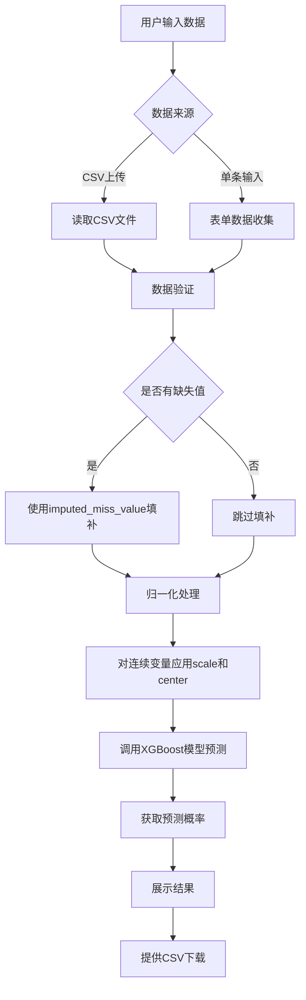
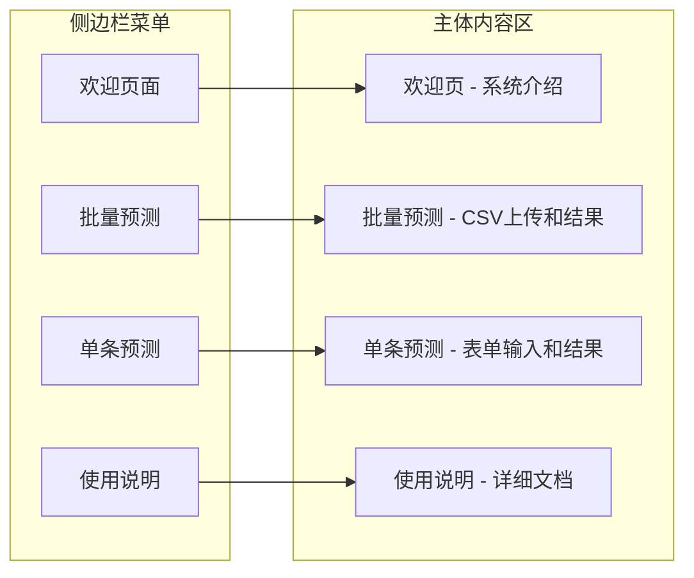

# DKD-Predict 糖尿病肾病智能诊断系统 - 设计方案

## 一、项目概述

### 1.1 应用名称
**DKD-Predict 糖尿病肾病智能诊断系统**

### 1.2 功能描述
基于 XGBoost 机器学习模型，帮助临床医生判断糖尿病合并 CKD 患者是否为糖尿病肾病（DKD）患者。

### 1.3 目标用户
- 肾内科医生
- 内分泌科医生
- 临床研究人员

---

## 二、技术架构

### 2.1 技术栈
- **R 版本**: 需要与模型训练环境一致
- **核心包**:
  - `shiny` - Web 应用框架
  - `shinydashboard` - 美化仪表板界面
  - `mlr3` (0.16.1) - 机器学习框架
  - `mlr3learners` (0.5.6) - 学习器扩展
  - `xgboost` (1.7.5.1) - XGBoost 算法
  - `tidyverse` - 数据处理
  - `DT` - 交互式数据表格
  - `shinyWidgets` - 增强 UI 组件

### 2.2 文件结构
```
web_app/
├── app.R                    # 主应用文件（单文件模式）
├── data/
│   ├── 10-Model-xgboost-all-model.rds    # XGBoost 模型
│   ├── 11-scale-miss_value.rdata          # 归一化和缺失值参数
│   └── 02-selected_vars.rdata             # 选择的变量
├── www/
│   └── custom.css           # 自定义样式（可选）
└── R/
    └── example.R            # 参考代码
```

---

## 三、特征变量说明

### 3.1 完整特征列表（17个变量）

| 变量名 | 中文名称 | 类型 | 单位 | 说明 |
|--------|----------|------|------|------|
| age | 年龄 | 连续 | 岁 | 患者年龄 |
| alb | 白蛋白 | 连续 | g/L | 血清白蛋白 |
| cr | 肌酐 | 连续 | μmol/L | 血肌酐 |
| cysc | 胱抑素C | 连续 | mg/L | 血清胱抑素C |
| egfr_ckd_epi | eGFR | 连续 | mL/min/1.73m² | CKD-EPI公式估算 |
| glu | 血糖 | 连续 | mmol/L | 空腹血糖 |
| hb | 血红蛋白 | 连续 | g/L | 血红蛋白浓度 |
| hba1c | 糖化血红蛋白 | 连续 | % | HbA1c |
| sbp | 收缩压 | 连续 | mmHg | 收缩压 |
| tcho | 总胆固醇 | 连续 | mmol/L | 血清总胆固醇 |
| uacr | 尿白蛋白肌酐比 | 连续 | mg/g | UACR |
| bun | 尿素氮 | 连续 | mmol/L | 血尿素氮 |
| GENDER | 性别 | 分类 | 0/1 | 0=女, 1=男 |
| dia_per | 糖尿病周围神经病变 | 分类 | 0/1 | 0=无, 1=有 |
| dia_ret | 糖尿病视网膜病变 | 分类 | 0/1 | 0=无, 1=有 |
| nep_syndrome | 肾病综合征 | 分类 | 0/1 | 0=无, 1=有 |
| urbc | 尿红细胞异常 | 分类 | 0/1 | 0=正常, 1=异常 |

### 3.2 变量分组

**连续变量（需要归一化，共12个）**:
- age, alb, cr, cysc, egfr_ckd_epi, glu, hb, hba1c, sbp, tcho, uacr, bun

**分类变量（0/1编码，共5个）**:
- GENDER, dia_per, dia_ret, nep_syndrome, urbc

---

## 四、数据处理流程



---

## 五、界面设计

### 5.1 页面布局（使用 shinydashboard）



### 5.2 各页面详细设计

#### 页面1：欢迎页面
- 系统标题和 Logo
- 功能介绍
- 快速开始按钮
- 版本信息

#### 页面2：批量预测
- 左侧：CSV 文件上传区域
- 右侧上方：上传数据预览表格
- 右侧下方：预测结果表格
- 底部：下载按钮

#### 页面3：单条预测
- 左侧：输入表单（分组显示）
  - 基本信息：年龄、性别
  - 肾功能指标：cr, cysc, egfr_ckd_epi, bun, uacr
  - 代谢指标：glu, hba1c, tcho, alb
  - 血液学指标：hb, sbp
  - 并发症：dia_per, dia_ret, nep_syndrome, urbc
- 右侧：预测结果展示
  - 风险概率（仪表盘或进度条）
  - 风险等级判断
  - 建议

#### 页面4：使用说明
- 系统介绍
- 输入变量说明
- 结果解读
- 注意事项

---

## 六、核心函数设计

### 6.1 缺失值填补函数
```r
impute_missing <- function(df, imputed_values, vars) {
  for (var in vars) {
    if (var %in% names(imputed_values)) {
      df[[var]][is.na(df[[var]])] <- imputed_values[var]
    }
  }
  return(df)
}
```

### 6.2 归一化函数
```r
scale_function <- function(df, vars_, center, scal) {
  df <- df %>%
    mutate(
      across(
        .cols = all_of(vars_),
        .fns = ~ (.x - center[cur_column()]) / scal[cur_column()]
      )
    )
  return(df)
}
```

### 6.3 预测函数
```r
predict_dkd <- function(model, new_data) {
  # 使用 mlr3 模型预测
  pred <- model$predict_newdata(new_data)
  prob <- pred$prob[, "1"]  # 假设正类标签为 "1"
  return(prob)
}
```

---

## 七、风险等级划分

| 概率范围 | 风险等级 | 颜色 | 建议 |
|----------|----------|------|------|
| 0-30% | 低风险 | 绿色 | DKD可能性较低，建议随访观察 |
| 30-60% | 中风险 | 黄色 | 存在DKD可能，建议进一步检查 |
| 60-100% | 高风险 | 红色 | DKD可能性较高，建议肾活检确诊 |

---

## 八、待确认事项

1. **模型预测的正类标签**：是 "1"、"TRUE" 还是 "DKD"？需要查看模型结构确认。

2. **风险等级阈值**：上述 30%/60% 的阈值是否合适？是否需要根据临床经验调整？

3. **是否需要多语言支持**：目前设计为中文界面，是否需要英文版本？

---

## 九、下一步行动

1. 创建 `app.R` 主应用文件
2. 实现所有 UI 组件
3. 实现 Server 逻辑
4. 测试功能完整性
5. 优化界面美观度

---

*设计文档版本: v1.0*
*创建日期: 2026-01-19*
